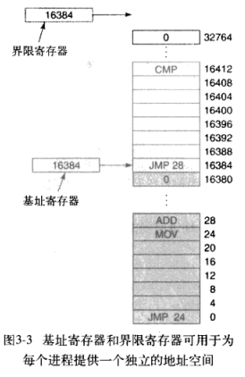
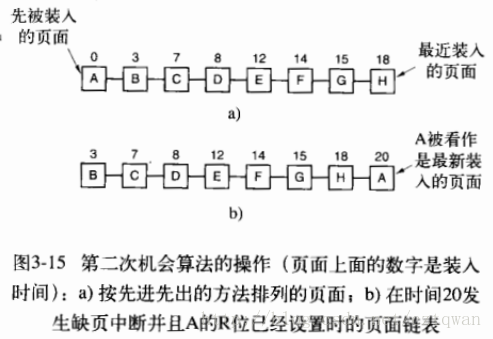
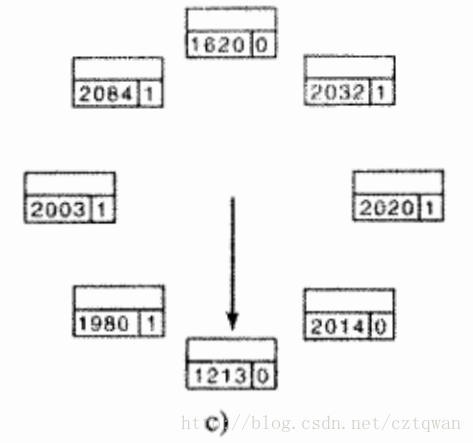

# Chapter03
# 第三章 内存管理 习题
- - - -
##  知识点小记
1. 当一个进程发生缺页中断的时候，进程会陷入**内核态**，执行以下操作：
1、检查要访问的虚拟地址是否合法
2、查找/分配一个物理页
3、填充物理页内容（读取磁盘，或者直接置0，或者啥也不干）
4、建立映射关系（虚拟地址到物理地址）
2. 当发生缺页中断/缺页错误时，操作系统要找一个较少使用的页框，把它的内容写回磁盘。把刚才需要访问的页面读到刚回收的页框中，修改MMU中的映射关系，有两处：将回收的虚拟页面的表项标记为未映射，把新装入的虚拟页面的页框号修改成回收的页框，并标记为已映射。
3. 16位的虚拟地址分为4位的页号和12位的偏移量。四位页号可以表示16个页面。页号作为页表的索引，以得到对应于虚拟页面的页框号。
4. 加速分页过程：
1.转换检测缓冲区（快表）（TLB）：将一个虚拟地址放入MMU中进行转换时，硬件首先将该虚拟页号与TLB中所有表项同时（并行）进行匹配，如果发现了有效匹配就直接从TLB中取出页框号，而不必再访问页表。如果没有有效匹配项，MMU就会进行正常的页表查询，接着从TLB中淘汰一个表象，用新找到的页表项代替它。
2.软件TLB管理。
5. 针对大内存的页表：
1.多级页表：顶级页表-二级页表-·······
2.倒排页表（反置页表）：表项和物理内存中的页框数量一样
6. 页面置换算法：
* OPT最优页面置换算法（不可能实现）
* NRU最近未使用页面置换算法：访问位R，修改位M，初始值设置为0，R位被定期清零。
* FIFO先进先出页面置换算法：发生缺页中断时，淘汰表头的页面并把新调入的页面加到表尾。
* Second Chance第二次机会页面置换算法：对FIFO的修改，如果表头的R位是0，则淘汰，若为1，则将R清零，并放回表尾。
* Clock时钟页面置换算法：把所有页面保存在环形链表中，用一个表针指向最老的页面，避免了在链表中移动页面。发生缺页中断时，首先检查指针指向的页面，如果R位是0，则淘汰，若为1，则将R位清零，并把指针前移一个位置。
* LRU最近最少未使用页面置换算法：在缺页中断发生时，置换未使用时间最长的页面，实现代价很高。
* NFU最不常用算法：每个页面与一个软件计数器相关联，每次发生时钟中断，将每个页面的R位加到计数器上。
* Aging老化算法：修改NFU，变成老化算法可以很好的模拟LRU。每次记录R位时，先将计数器右移，然后把R的值加到最高位。发生缺页中断时，将置换计数器值最小的页面。有两点区别：1.无法区分一个时钟滴答中页面访问的先后顺序。2.老化算法的计数器位数是有限的，限制了对以往页面的记录。
* 工作集页面置换算法：发生缺页中断时，淘汰一个不在工作集中的页面。工作集是最近k次内存访问所使用过的页面的集合。但是计算出工作集并不容易，常见的方法是用一定时间内内存访问的页面的集合作为工作集的近似。需要记录上次访问时间。
* WSClock工作集时钟页面置换算法 ：与时钟算法有点类似，把所有页面保存在环形链表中。发生缺页中断时，首先检查指针指向的页面，若为1，则将R位清零，并把指针前移一个位置。如果R位是0，则计算生存时间，并与t比较，若大于t且页面是干净的（在磁盘上有副本），则淘汰页面，否则指针前移。
* PFF缺页中断率算法：计算每秒的缺页中断数，调整分配集（给进程在内存中分配多少页框）的大小。
7. 分页守护进程：定期被唤醒以检查内存的状况，空闲页框过少，则根据算法选择页面换出内存，如果页面被修改过，就写回磁盘。如果想使用一个被淘汰的页面，且页框还没有被覆盖，则可以从空闲页框缓冲池中移出并恢复该页面。
8. **缺页中断处理**：
* 硬件陷入内核，堆栈保存程序计数器PC，把当前指令的状态保存在特殊的CPU寄存器中。
* 启动汇编代码例程保存通用寄存器和易失信息。
* 操作系统尝试发现需要那个虚拟页面，如果硬件寄存器没有包含这一信息，操作系统必须检索程序计数器，取出指令，并用软件分许。
* 知道了发生缺页中断的虚拟地址后，先检查这个地址是否有效，并检查存取与保护是否一致：若不一致，向进程发出信号或杀死进程；若地址有效且没有保护错误，则检查是否有空闲页框，若没有则用页面置换算法寻找一个页面来淘汰。
* ·······
* 当磁盘中的页面内容全部装入页框后，向操作系统发送一个中断。操作系统更新内存中的页表项，将虚拟页面映射的页框号更新为写入的页框，并将页框标记为正常状态。
* 恢复缺页中断发生前的状态，程序指令器重新指向引起缺页中断的指令。
* 调度引起页面中断的进程，操作系统返回汇编代码例程。
* 汇编代码例程恢复现场，将之前保存在通用寄存器中的信息恢复。
9. 32位虚拟地址包含10位目录，10位页面和12位偏移量。
- - - -
## 1.IBM360有一个设计，为了对2KB大小的块进行加锁，会对每个块分配一个4bit的密钥，这个密钥存在PSW（程序状态字）中，每次内存引用时，CPU都会进行密钥比较。但该设计有诸多缺陷，除了描述中所言，请另外提出至少两条缺点。
A：密钥只有四位，故内存只能同时容纳最多十六个进程；需要用特殊硬件进行比较，同时保证操作迅速。
- - - -
## 2.在图3-3中基址和界限寄存器含有相同的值16384，这是巧合，还是它们总是相等？如果这只是巧合，为什么在这个例子里它们是相等的？
                            
A：巧合。基地址寄存器的值是进程在内存上加载的地址；界限寄存器指示存储区的长度。
- - - -
## 3.交换系统通过紧缩来消除空闲区。假设有很多空闲区和数据段随机分布，并且读或写32位长的字需要10ns的时间，紧缩128MB大概需要多长时间？为了简单起见，假设空闲区中含有字0，内存中最高地址处含有有效数据。
A：32bit=4Byte===>每字节10/4=2.5ns
	128MB=128*2^20=2^27Byte
	对每个字节既要读又要写，2*2.5*2^27=671ms
- - - -
## 4.在一个交换系统中，按内存地址排列的空闲区大小是10MB，4MB，20MB，18MB，7MB，9MB，12MB，和15MB。对于连续的段请求：
## (a) 12MB
## (b) 10MB
## (c)  9MB
## 	使用首次适配算法，将找出哪个空闲区？使用最佳适配、最差适配、下次适配算法呢？
A：
首次适配算法：20MB，10MB，18MB；
最佳适配算法：12MB，10MB，9MB；
最差适配算法：20MB；18MB；15MB；
下次适配算法：20MB；18MB；9MB；
- - - -
## 5.物理地址和虚拟地址有什么区别？
A：实际内存使用物理地址。这些是存储器芯片在总线上反应的数字。虚拟地址是指一个进程的地址空间的逻辑地址。因此，具有32位字的机器可以生成高达4GB的虚拟地址，而不管机器的内存是否多于或少于4GB。
- - - -
## 6.对下面的每个十进制虚拟地址，分別使用4KB页面和8KB页面计算虚拟页号和偏移量：20000，32768，60000。
A：转换为二进制分别为：0100111000100000    虚拟地址应该是16位
					       1000000000000000
					       1110101001100000
4KB页面偏移量范围0～4027，需要12位来存储偏移量，剩下4位作为页号；
同理8KB页面需要13位来存储偏移量，剩下3位作为页号；
所以，
                              4KB       			|			8KB
		       页号 |  偏移量			|		 页号 |  偏移量	
20000 |      0100    111000100000   |   		010      0111000100000
32768 |      1000    000000000000   |                100      0000000000000
60000 |      1110    101001100000   |                111      0101001100000
- - - -
## 7. 使用图3-9的页表，给出下面每个虚拟地址对应的物理地址：
## (a) 20
## (b) 4100
## (c) 8300
A：	
（a）20+4096*2=8212
（b）4100=4096+（4100-4096）=4100
（c）8300=6*4096+（8300-4096*2）=24684
- - - -
## 8. Inlel 8086处理器不支持虚拟内存，然而一些公司曾经设计过包含未作任何改动的8086 CPU的分页系统。猜想一下，他们是如何做到这一点的。（提示：考虑MMU的逻辑位置。）
A：他们制作了MMU，并连接在CPU与地址总线之间，这样从处理器进入MMU的地址全部被视为虚拟地址，并被转换为物理地址，然后被送到地址总线，映射到内存中。
- - - -
## 9.为了让分页虚拟内存工作，需要怎样的硬件支持？
A：需要一个MMU能够将虚拟页面重新映射到物理页面。此外，当缺页中断时，需要对操作系统设置陷阱，以便可以获取页面。
- - - -
## 10.写时复制是使用在服务器系统上的好方法，它能否在手机上起作用。
A：	“写时复制“技术，也就是只有进程空间的各段的内容要发生变化时，才会将父进程的内容复制一份给子进程。
	如果智能手机支持多重编程，iPhone、Android和Windows手机都支持多重编程，那么支持多个进程。如果进程发出fork()系统调用和页面在父进程和子进程之间共享，则复制对写是有意义的。智能手机比服务器小，但从逻辑上讲，它并没有什么不同。
- - - -
## 11.考虑下面的C程序：
## 	int X[N];
## 	int step = M; //M是某个预定义的常量
## 	for (int i = 0; i < N; i += step) X[i] = X[i] + 1;
## a)如果这个程序运行在一个页面大小为4KB且有64 个TLB 表项的机器上时，M和N取什么值会使得内层循环的每次执行都会引起TLB失效?
## b)如果循环重复很多遍，结果会和a)的答案相同吗？请解释。
A:
a)M必须至少为1024，以确保对X元素的每一次访问都有一个TLB缺失。因为N只影响X访问多少次，N取大于M的任何值都可以。
b)M应该至少是1024，以确保对X元素的每次访问都遗漏TLB。但是现在N应该大于64K，以便处理TLB，也就是说，X应该超过256KB。
- - - -
## 12.存储页面必须可用的磁盘空间和下列因素有关：最大进程数n，虚拟地址空间的字节数v，RAM的字节数r，给出最坏情况下磁盘空间需求的表达式。这个数量的真实性如何？
A：所有进程的整个虚拟地址空间为nv，这就是页面存储所需的。不过，可以在RAM中存储量为r，因此需要的磁盘存储量仅为nv-r。该量比实际所需的要大得多，因为极少有n个进程实际运行，而且这些进程也极少需要其最大允许的虚拟内存。
- - - -
## 13.如果一条指令执行1ns，缺页中断执行额外的Nns，且每条k指令产生一个缺页，请给出一个公式，计算有效指令时间。
A：	(1*(k-1)+(1+N))/k = 1+N/k     ns
- - - -
## 14.一个机器有32位地址空间和8KB页面，页表完全用硬件实现，页表的每一表项为一个32位字。进程启动时，以每个字100ns的速度将页表从内存复制到硬件中。如果每个进程运行100ms（包含装入页表的时间）用来装人页表的CPU时间的比例是多少？
A:
~~32位地址空间构成4GB内存空间，4GB/8KB=512个页面，页表项512项，页表大小512·32=2^14 bit,复制页表的时间=2^14/2^5*10ns = 5120 ns,~~
~~时间比例5120ns/100ms=5120·10^(-9)   /  100·10^(-3) =51.2%~~ 
8KB页面大小，需要13位偏移量，故页号有19位，页面有2^19个，页表项也是2^19个，每项32位字。
2^19·100ns/100ms=52.4288%
- - - -
## 15.假设一个机器有48位的虚拟地址和32位的物理地址。
## 	a)假设页面大小是4KB，如果只有一级页表，那么在页表里有多少页表项？ 请解释。
## 	b)假设同一系统有32个TLB表项，并且假设一个程序的指令正好能放入一个页，并且该程序顺序地从有数千个页的数组中读取长整型元素。在这种情况下TLB的效果如何？
A：
a）页面大小4KB，偏移量有12位，则页号有36位，有2^36项页表项；
b）TLB访问的命中率达100%。在指令访问下一个页面之前读取数据的命中率是100%，一个4KB大小的页面包含1024个长整型数据，每访问1024个数据就会有一次TLB失效。
- - - -
## 16.给定一个虚拟内存系统的如下数据：
## （a）TLB有1024项，可以在1个时钟周期（1ns）内访问。
## （b）页表项可以在100时钟周期（100ns）内访问。
## （c）平均页面替换时间是6ms。
## 如果TLB处理的页面访问占99%，并且0.01%的页面访问会发生缺页中断，那么有效地址转换时间是多少？
A： ~~99%·1ns+1%·99.99%·100ns+1%·0.01%·6ms=7.9899~~
	99%·1ns+0.99%·100ns+0.01%·6ms=601.98ns

- - - -
## 17. 假设一个机器有38位的虚拟地址和32位的物理地址。
## 	 a)与一级页表比较，多级页表的主要优点是什么？
## 	 b)若采用二级页表，页面大小为16KB，每个页表项为4字节，应该对第一级页表域分配多少位,对第二级页表域分配多少位？请解释原因
A：
	a）避免把全部页表一直保存在内存中。
	b） ~~”16KB个页“估计是指这个二级页表的大小是16KB，故页表项有16KB/4B=4K个，二级页表域需要12位，四字节表项说明页面大小是12~~
	页面大小16KB，则偏移量需要14位，每个条目4字节
- - - -
## 18.在3.3.4节的陈述中，奔腾Pro将多级页表中的每个页表项扩展到64位，但仍只能对4GB的内存进行寻址。请解释页表项为64位时，为何这个陈述正确。
A：虽然页表项扩展了，但是虚拟内存地址依然只有32位。
- - - -
## 19.个32位地址的计算机使用两级页表。 虚拟地址被分成9位的顶级页表域、 11位的二级页表域和一个偏移量，页面大小是多少？在地址空间中一共有多少个页面？
A：
页面大小与偏移量位数有关=2^12Byte=4KB,每个地址对应内存一个字节，
地址空间的页面数量=2^20个。
- - - -
## 20.一个计算机使用32位的虚拟地址，4KB大小的页面。程序和数据都位于最低的页面（0~4095），栈位于最高的页面。如果使用传统（一级）分页，页表中需要多少个表项？如果使用两级分页，每部分有10位，需要多少个页表项？
A：32位地址对应4GB内存，有4GB/4KB=2^20个页面,如果使用传统（一级）分页：需要2^20个页表项；如果使用两级分页，顶级页表有2^10个页表项，其中三项指向二级页表（程序段、数据段、堆栈段），二级页表每个也有有2^10个页表项，总共2^12个页表项。
- - - -
## 21.如下是在页大小为512字节的计算机上，一个程序片段的执行轨迹。这个程序在1020地址，其栈指针在8192（栈向0生长）。请给出该程序产生的页面访问串。每个指令（包括立即常数）占4个字节（1个字）。指令和数据的访问都要在访问串中计数。
## 	将字6144载入寄存器0
## 	寄存器0压栈
## 	调用5120处的程序，将返回地址压栈
## 	栈指针减去立即数16
## 	比较实参和立即数4
## 	如果相等，跳转到5152处
~~A：程序地址范围1020～1532。~~
~~页面访问串：6144-8191——5120——8190———8184———5152.~~
A：每个页面512B，1020地址属于512～1023，即页面1；栈指针8192属于8192～8704，即页面16，但是栈向0生长，故寄存器压栈到8191～8188，属于页面15；5152地址属于5120～5631，即页面10.
每条指令4个字节，故第一条指令在地址范围1020～1023，属于页面1；第二条指令在地址范围1024～1027，属于页面2；第三条指令地址也在页面2，但是将数据压栈到页面15了。
	LOAD  6144,R0				1(I), 12(D)
	PUSH R0					2(I), 15(D)
	CALL 5120					2(I), 15(D)
	JEQ 5152					10(I)
代码（I）指示指令引用，而（D）指示数据引用。
- - - -
## 22.一台计算机的进程在其地址空间有1024个页面，页表保存在内存中。从页表中读取一个字的开销是5n。为了减小这一开销，该计算机使用了TLB，它有32个（虚拟页面，物理页框）对，能在1ns内完成查找。请问把平均开销降到2ns需要的命中率是多少？
A：p·1+(5+1)·（1-p）< 2 ======>p>0.8
- - - -
## 23.TLB需要的相联存储设备如何用硬件实现，这种设计对扩展性意味着什么？
A:相联存储器本质上将key与多个寄存器的内容同时进行比较。对于每个寄存器，必须有一组比较器，将寄存器内容中的每个位与正在搜索的键进行比较。实现这种设备所需的门（或晶体管）的数量是寄存器数量的线性函数，因此这种设计对扩展性意味着成本变得昂贵。
- - - -
## 24.一台机器有48位虚拟地址和32位物理地址，页面大小是8KB，试问页表中需要多少个表项？
A: ~~物理内存是4GB，页面数量是4GB/8KB=2^19项，~~ 页面偏移量需要2^13位，页表域总共35位。
- - - -
## 25.一个计算机的页面大小为8KB，内存大小为256KB，虚拟地址空间为64GB，使用倒排页表实现虚拟内存。为了保证平均散列链的长度小于1，散列表应该多大？假设散列表的大小为2的幂。
A：（原答案）内存有2^28(256KB) / 2^13(8KB) =(2^15)32768页。32K的哈希表的平均链长为1。为了使之小于1，必须使用下一个尺寸(2^16)65536项。将32768项放入65536格中使其平均链长为0.5，以保证快速的查询。
（这个题目有错吧？？？内存应该是256MB才对）
物理页面数=256MB/8KB=2^15，若散列表为2^15，则平均散列长度为1，为保证平均散列链长度小于1，散列表至少为2^16.
- - - -
## 26.一个学生在编译器设计课程中向教授提议了一个项目：编写一个编译器，用来产生页面访问列表，该列表可以用于实现最优页面置换算法。试问这是否可能？为什么？有什么方法可以改进运行时的分页效率？
A：这是不可能的，除了程序的执行过程在编译时是完全可预测的少数情况。如果编译器收集程序有关调用代码中的位置信息，则可以在链接时使用此信息来重新排列目标代码，以便程序位于它们调用的代码附近。这将使得进程更可能与所调用的代码在同一个页面上。当然这从许多地方进行调用的程序来说是无效的。
- - - -
## 27.假设虚拟页码索引流中有一些长的页码索引序列的重复，序列之后有时会是一个随机的页码索引。例如，序列0，1，…，511，431，0，1，…，511，332， 0，1，…中就包含了0，1，…，511的重复，以及跟随在它们之后的随机页码索引431和332。
##  	a)在工作负载比该序列短的情况下，标准的页面置换算法（LRU，FIFO，Clock) 在处理换页时为什么效果不好？
## 	b)如果一个程序分配了500个页框，请描述一个效果优于LRU、FIFO或Clock算法的页面置换方法。
A：
a)标准的页面置换算法是针对已经在内存中的页面研究的。当工作负载比序列短时，会出现内存容量不够而长生颠簸，这种情况下LRU、Clock、FIFO算法达不到预期的效果，任何访问都会引起缺页除非内存的页框数量大于512。
b)如果分配了500个页框，那么0~498号页框是固定的，只有一个页框进行页面置换。
- - - -
## 28.如果将FIFO页面罝换算法用到4个页框和8个页面上，若初始时页框为空，访问字符串为0172327103，请问会发生多少次缺页中断？如果使用LRU算法呢？
A：                      四个页框 			
FIFO			6							
LRU				7
- - - -
## 29.考虑图3- 15b中的页面序列。假设从页面B到页面A的R位分别是11011011。 使用第二次机会算法，被移走的是哪个页面？
   				
A：D。
- - - -
## 30. 一台小计算机有4个页框。在第一个时钟滴答时R位是0111（页面0是0，其他页面是1），在随后的时钟滴答中这个值是1011、1010、1101、0010、1010、 1100、0001。如果使用带有8位计数器的老化算法，给出最后一个滴答后4个计数器的值。
A：
0号页框：01101110
1号页框：01001001
2号页框：00110111
3号页框：10001011
- - - -
## 31.请给出一个页面访问序列，使得对于这个访问序列，使用Clock和LRU 算法得到的第一个被选择置换的页面不同。假设一个进程分配了3个页框，访问串中的页号属于集合0，1，2，3。
A：0130123。LRU将第3页替换为第2页。Clock将第0页替换为第2页。
- - - -
## 32.在图3-21c的工作集时钟算法中，表针指向那个R = 0的页面。如果τ=400，这个页面将被移出吗？如果τ= 1000呢？（当前时间2204）

A：该页面的生存时间是2204 - 1213 = 991。如果τ= 400，它就不在工作集中，最近没有被引用，所以它将被移出。τ= 1000的情况不同，此时页面在工作集中，所以它不会被删除。
- - - -
## 33
- - - -
## 42.人们已经观察到在两次缺页中断之间执行的指令数与分配给程序的页框数直接成比例。如果可用内存加倍，缺页中断间的平均间隔也加倍。假设一条普通指令需要1μm，但是如果发生了缺页中断，就需要2001μs （即2ms处理缺页中断），如果一个程序运行了60s，期间发生了15000次缺页中断，如果可用内存是原来的两倍，那么这个程序运行需要多少时间？
A：该程序发生了15000次缺页中断，每个缺页中断都需要2ms的额外处理时间。处理缺页中断的总开销为30s。这意味着在程序运行的60s内，一半用于缺页中断开销，一半用于运行程序。如果我们运行程序的内存是内存的两倍，我们会得到一半的内存页错误，只有15秒的页面错误开销，所以总的运行时间将是45秒。
- - - -
## 43.Frugal计算机公司的一组操作系统设计人员正在考虑在他们的新操作系统中减少对后备存储数量的需求。老板建议根本不要把程序正文保存在交换区中，而是在需要的时候直接从二进制文件中调页进来。在什么条件下（如果有这样的条件话）这种想法适用于程序文本？在什么条件下（如果有这样的条件话）这种想法适用于数据？
A：这种想法适用于无法修改的程序和不能被修改的数据。但是，通常程序不能修改，数据却极少数无法修改。如果二进制文件中的数据区被更新的页面覆盖，下一次程序启动时，它将不会有原始数据。
- - - -
## 44.有一条机器语言指令将要被调入，该指令可把一个32位字装入含有32位字地址的寄存器。这个指令可能引起的最大缺页中断次数是多少？
A：该指令可能跨越页面边界，为了获取指令将导致两个缺页中断。获取的字也可能跨越页边界，产生两个以上的缺页中断，总共四个。如果字必须在内存中对齐，则数据字只能导致一个缺页中断，但是在某些机器（包括奔腾）上，在具有4 KB页面的机器上的4094地址上加载32位字的指令是合法的。
- - - -
## 46.像在MULT1CS中那样，当同时使用分段和分页时，首先必须查找段描述符，然后是页描述符。TLB也是这样按两级查找的方式工作的吗？
答：否。搜索键使用段号和虚拟页码，因此可以在单个匹配中找到确切的页面。
- - - -
## 47.一个程序中有两个段，段0中为指令，段1中为读/写数据。段0有读/执行保护，段1有读/写保护。内存是请求分页式虚拟内存系统，它的虚拟地址为4位页号，10位偏移量。页表和保护如下所示（表中的数字均为十进制）：	
## （表格略）
## 	 对于下面的每种情形，或者给出动态地址所对应的实（实际）内存地址，或者指出发生了哪种失效（缺页中断，或保护错误）。
##  a)读取页：段1，页1，偏移3；
##  b)存储页：段0，页0，偏移16；
##  c)读取页：段1，页4，偏移28；
##  d)跳转到：段1，页3，偏移32。
A：
- - - -
## 48.你能想象在哪些情况下支持虚拟内存是个坏想法吗？不支持虚拟内存能得到什么好处呢？请解释。
A：一般来说，当可以了解和控制所有应用程序的需求时，虚拟内存就没必要了。例如，特殊用途的处理器（如网络处理器），嵌入式处理器和超级计算机（如机翼设计）。在这些情况下，我们总会考虑使用更多的物理内存。如果操作系统没有使用（不支持）虚拟内存，它的代码会简单很多，系统的性能会有所提高。另一方面，一些来自虚拟内存的想法有利于开发，尽管有不同的设计需求。
- - - -

