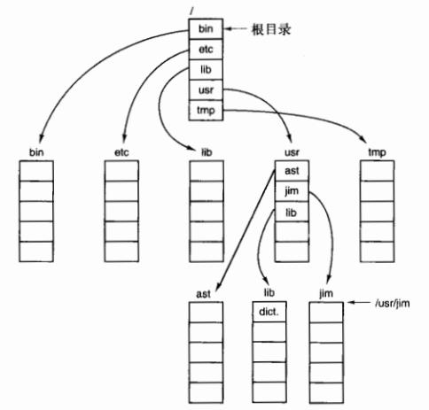

# Chapter04 
# 第四章 文件系统  习题
- - - -
## 知识点小记
- - - -
1. 文件类型：
①普通文件：包含有用户信息的文件，分为ASCII文件和二进制文件。
②目录：管理文件系统结构的系统文件；
③字符特殊文件（UNIX）：与输入/输出有关，用于串行I/O类设备，如终端、打印机、网络等。
④块特殊文件（UNIX）：用于磁盘类设备。
2. 文件访问方式：顺序访问、随机访问。
3. 绝对路径名：由从根目录到文件的路径组成；相对路径名：所有不从根目录开始的路径名。
4. 文件系统存放在磁盘上。磁盘可划分为一个或多个分区，每个分区有一个独立的文件系统。磁盘的0号扇区称为**主引导记录**（MBR），用来引导计算机。MBR的结尾是分区表，该表给出了每个分区的**起始和结束地址**。
5. 计算机被引导时，BIOS读入并执行MBR。MBR做的第一件事是确定活动分区，读入它的第一个块—“引导块”。
6. 文件存储的实现：
①连续分配。优点：实现简单；读操作性能较好。缺点：随时间推移会产生大量碎片。
②链表分配。优点：可以充分利用每个磁盘块，不会因为磁盘碎片而浪费存储空间；顺序读取文件方便。缺点：随机访问相当缓慢；由于指针占去了一些字节，每个磁盘块存储数据的字节数不再是2的整数次幂，降低了系统效率。
③采用内存中的表进行链表分配。把之前每个磁盘块的指针字放在内存中的一个表（文件分配表FAT）中，就可以解决上述链表的两个不足。缺点：必须把整个表放在内存中，如果磁盘块很多，表占用的空间会很大，此时该方法并不实用，不能较好地扩展并应用于大型磁盘中。
7. 用i节点记录各个文件分别包含哪些磁盘块。文件打开时，其i节点才在内存中。
8. 目录系统的主要功能是把ASCII文件名映射成定位文件数据所需的信息。操作系统利用用户给出的路径名找到相应目录项。目录项中提供了查找文件磁盘块所需要的信息。
9. 文件属性存储的位置：①**直接放在目录项中**，目录中有一个固定大小的目录项列表，每个文件对应一项，其中包括一个固定长度的文件名、一个文件属性的结构体以及说明磁盘位置的一个或多个磁盘地址；②把文件属性存放**在i节点**中，这是目录项会更短：只有文件名和i节点号。第二种方法更好。
10. 日志结构文件系统LFS、日志文件系统、虚拟文件系统VFS。
11. 虚拟文件系统，抽象出所有文件系统共有的部分，并将这部分代码放在单独的一层，该层调用底层的实际文件系统来具体管理数据。绝大多数UNIX采用VFS。
12. 改善文件系统的性能：
①高速缓存
②块提前读：只适用于实际顺序读取的文件
③减少磁盘臂运动：把可能顺序访问的块放在一起
13. 文件系统实例：
①MS-DOS文件系统：按32位的数字存储文件的大侠，理论上文件大小能够大至4GB，通过内存中的**文件分配表**(FAT)来跟踪文件块。
②UNIX V7文件系统：文件系统从根目录开始形成树状，加上链接，形成了一个有向无环图。
③CD-ROM文件系统：不需要记录空闲块。每个CD-ROM有16块作为开始，制造商可以在这一区域放入引导程序。接下来的一块放**基本卷描述符**，包含CD-ROM的一些基本信息（系统标识符32字节、卷标识符32字节、发布标识符218字节、数据预备标识符128字节）。
- - - -

## 习题答案
- - - -
Q1: 给出文件/etc/passwd的五种不同的路径名。（提示：考虑目录项”.”和”..”。）

A:

/etc/passwd
/./etc/passwd
/././etc/passwd
/./././etc/passwd
/etc/../etc/passwd
/etc/../etc/../etc/passwd
/etc/../etc/../etc/../etc/passwd
/etc/../etc/../etc/../etc/../etc/passwd
- - - -
Q2：在Windows中，当用户双击资源管理器中列出的一个文件时，就会运行一个程序，并以这个文件作为参数。操作系统要知道运行的是哪个程序，请给出两种不同的方法。

A:Windows使用文件扩展名。每种文件扩展名对应一种文件类型和某些能处理这种类型的程序。另一种方式时记住哪个程序创建了该文件，并运行那个程序。Macintosh以这种方式工作。

- - - -
Q3：在早期的UNIX系统中，可执行文件（a.out）以一个非常特別的魔数开始，这个数不是随机选择的。这些文件都有文件头，后面是正文段和数据段。为什么要为可执行文件挑选一个非常特别的魔数，而其他类型文件的第一个字反而有一个或多或少是随机选择的魔数？

A：这些系统直接把程序载入内存，并且从word0（魔数）开始执行。为了避免将header作为代码执行，魔数是一条branch指令，其目标地址正好在header之上。按这种方法，就可能把二进制文件直接读取到新的进程地址空间，并且从0 开始运行。

- - - -
Q4:  在UNIX中open系统调用绝对需要吗？如果没有会产生什么结果？

A:	open调用的目的是：把文件属性和磁盘地址表装入内存，便与后续调用的快速访问。
	 首先，如果没有open系统调用，每次读取文件都需要指定要打开的文件的名称。系统将必须获取其i节点，虽然可以缓存它，但面临一个问题是何时将i节点写回磁盘。可以在超时后写回磁盘，虽然这有点笨拙，但它可能起作用。

- - - -
Q5:在支持顺序文件的系统中总有一个文件回绕操作，支持随机存取文件的系统是否也需要该操作？

A：否。如果要再次读取文件，只需随机访问字节0。

- - - -
Q6:某一些操作系统提供系统调用rename给文件重命名，同样也可以通过把文件复制到新文件并删除原文件而实现文件重命名。请问这两种方法有何不同？

A：rename调用不会改变文件的创建时间和最后的修改时间，但是创建一个新的文件，其创建时间和最后的修改时间都会改为当前的系统时间。另外，如果磁盘满，复制可能会失败。

- - - -
Q7: 在有些系统中有可能把部分文件映射进内存中。如此一来系统应该施加什么限制？这种部分映射如何实现？

A：文件的映射部分必须以页边界开始，并且长度为整数页数。每个映射的页面使用文件本身作为后备存储。未映射的内存使用临时文件或分区作为后备存储。

- - - -
Q8: 有一个简单操作系统只支持单一目录结构，但是允许该目录中有任意多个文件，且带有任意长度的名字。这样可以模拟层次文件系统吗？如何进行？

A：使用文件名，如/usr/ast/file。虽然它看起来像一个层次化的路径名称，但它只是一个包含嵌入的斜杠的单一名称。

- - - -
Q9: 在UNIX 和Windows 中通过使用一个特殊的系统调用把文件的“当前位置”指针移到指定字节，从而实现了随机访问。请提出一个不使用该系统调用完成随机存取的替代方案。

A：一种方法是在读取系统调用中添加一个额外的参数，告诉你要读取哪个地址。实际上，每次读取都有可能在文件中进行搜索。该方案的缺点是（1）每个读取调用都含有额外参数，以及（2）要求用户跟踪文件指针在哪里。

- - - -
Q10：考虑图4-8中的目录树，如果当前工作目录是/usr/jim，则相对路径名为../ast/x的文件的绝对路径名是什么？

A: ..将搜索移动到/usr，所以../ast就是/usr/ast。因此../ast/x与/usr/ast/x相同。

- - - -
Q11: 正如书中所提到的，文件的连续分配会导致磁盘碎片，因为当一个文件的长度不等于块的整数倍时，文件中的最后一个磁盘块中的空间会浪费掉，请问这是内碎片还是外碎片？并将它与先前一章的有关讨论进行比较。

A：原答案：由于这些被浪费的空间在分配单元(文件)之间，而不是在它们内部，因此，这是外部碎片。这类似于交换系统或者纯分段系统中出现的外部碎片。
	网上有人说这个答案是错的，说应该是内部碎片，这里是混淆了内存的内部/外部碎片，和磁盘的内部/外部碎片的区别。

> 一、在内存上（使用连续分配算法来管理分配内存时会产生）的外部碎片和内部碎片两个概念  
>   
> 内存碎片分为：内部碎片和外部碎片  
>   
> 【内部碎片】  
> 	内部碎片就是已经被分配出去（能明确指出属于哪个进程）却不能被利用的内存空间；  
> 	**内部碎片**是处于**（操作系统分配的用于装载某一进程的内存）区域内部**或页面内部的存储块。占有这些区域或页面的进程并不使用这个存储块。而在进程占有这块存储块时，系统无法利用它。直到进程释放它，或进程结束时，系统才有可能利用这个存储块。  
>   
> 	 **单道连续分配**只有内部碎片。**多道固定连续**分配既有内部碎片，又有外部碎片。  
>   
> 【外部碎片】  
> 	外部碎片指的是还没有被分配出去（不属于任何进程），但由于太小了无法分配给申请内存空间的新进程的内存空闲区域。  
> 	 外部碎片是处于任何两个已分配区域或页面之间的空闲存储块。这些存储块的总和可以满足当前申请的长度要求，但是由于它们的地址不连续或其他原因，使得系统无法满足当前申请。  
>   
> 	 产生外部碎片的一种情况：  
> 	举个例子，在内存上，分配三个**操作系统分配的用于装载进程的内存区域**A、B和C。假设，三个**内存区域**都是相连的。故而三个***内存区域***不会产生外部碎片。现在假设B对应的进程执行完毕了操作系统随即收回了B，这个时候A和C中间就有一块空闲区域了。  
>   
> **多道可变连续分配**只有外部碎片。  
>   
> 二、在磁盘上的外部碎片和内部碎片两个概念  
>   
> 	总之，在内存上，外部碎片是位于任何两个### 操作系统分配的用于装载进程的内存区域### 或页面之间的空闲区域，内部碎片是位于一个**操作系统分配的用于装载进程的内存区域**或页面内部的空闲区域。  
> 在磁盘上的外部碎片和内部碎片两个概念  
>   
> 很多人会把文件碎片跟簇的概念混淆起来。其实对windows系统来说硬盘上的每个分区都是由最小存储单元——簇组成的。就好比，一面墙是由一块块转头组成的。簇的大小可以在分区格式化时由用户定义，一般是数个KB大小，比如是8KB。假设我有一个文件，大小是80MB零1KB（1MB=1000KB），换算一下就是80,001KB，其中的80,000KB正好占用10000个簇，**剩下的那1KB，不得以也要占用1个簇，但这最后一个簇还有7KB的空间没用上了。而且这个未完全使用的簇，其他文件也不允许继续使用。**这就造成了一点点的空间浪费。  
> **不少人就把这被浪费了的7KB空间就是磁盘上的内部碎片。**  
>   
> 而**磁盘上的外部碎片（即平时所说的磁盘碎片，磁盘碎片清理工具只能清理磁盘上的外部碎片，清除不了磁盘上的内部碎片，除非改变文件系统的分配单位即簇的大小，使之是一个文件大小的整数倍。）**实际上指的是一个文件占据那些簇是不连续的，就相当于文件被分割开来，分别存放在相互间断的几段簇上。文件被分割为几个部分就是几个碎片。所以碎片其实是指文件碎片，可以理解成，文件破碎成片之意。而且文件碎片之间有时候顺序还是错乱的。比如说，有时候“文件里靠后的碎片”所占的簇段在硬盘上反而会排在“文件里位置靠前的碎片”簇段的前面。这样一来，一个文件就会以比较混乱的顺序存放在硬盘上。  
> **显然计算机读取连续的有序的数据肯定要比不连续的乱序的数据来得快。所以整理碎片可能会大幅度提高系统性能。**  
> 举个例子，起初硬盘某个分区是空白的，写入三个文件A、B和C。显然这个时候，三个文件都是顺次占用三个簇段**（这个说明存放文件所用的文件系统应该是类似FAT这样的文件系统，具体参看注释1）**。故而三个文件不会产生碎片。  
> 现在假设你删除了B文件，这个时候A和C中间就有一块空闲簇段了。此时还是不存在文件碎片的，因为每个文件各自占据的簇段都是连续的，没有文件被分割。而如果现在需要写入一个文件D，而且D比刚刚删去的文件B要大。那么A和C之间的空闲簇段就不足以放入D，再假设C后面的空闲簇段也不足以放下D，这个时候D就势必要分割成两块存放，一块放在A和C之间，另一块放在C之后。这样一来，文件碎片就产生了。D文件有两个文件碎片。  
> 磁盘碎片整理要做的工作就是：把C文件前移，一直移到紧接A文件的簇段上去。这样A和C之间就没有空闲簇了，C之后剩下的将是一段完整的空闲簇段，足以放下文件D。这样D就也占据一段连续的簇段。碎片也就消除了。  

