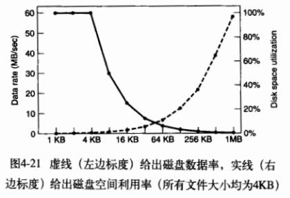

# Chapter04 
# 第四章 文件系统  习题
- - - -
## 知识点小记
- - - -
1. 文件类型：
①普通文件：包含有用户信息的文件，分为ASCII文件和二进制文件。
②目录：管理文件系统结构的系统文件；
③字符特殊文件（UNIX）：与输入/输出有关，用于串行I/O类设备，如终端、打印机、网络等。
④块特殊文件（UNIX）：用于磁盘类设备。
2. 文件访问方式：顺序访问、随机访问。
3. 绝对路径名：由从根目录到文件的路径组成；相对路径名：所有不从根目录开始的路径名。
4. 文件系统存放在磁盘上。磁盘可划分为一个或多个分区，每个分区有一个独立的文件系统。磁盘的0号扇区称为**主引导记录**（MBR），用来引导计算机。MBR的结尾是分区表，该表给出了每个分区的**起始和结束地址**。
5. 计算机被引导时，BIOS读入并执行MBR。MBR做的第一件事是确定活动分区，读入它的第一个块—“引导块”。
6. 文件存储的实现：
①连续分配。优点：实现简单；读操作性能较好。缺点：随时间推移会产生大量碎片。
②链表分配。优点：可以充分利用每个磁盘块，不会因为磁盘碎片而浪费存储空间；顺序读取文件方便。缺点：随机访问相当缓慢；由于指针占去了一些字节，每个磁盘块存储数据的字节数不再是2的整数次幂，降低了系统效率。
③采用内存中的表进行链表分配。把之前每个磁盘块的指针字放在内存中的一个表（文件分配表FAT）中，就可以解决上述链表的两个不足。缺点：必须把整个表放在内存中，如果磁盘块很多，表占用的空间会很大，此时该方法并不实用，不能较好地扩展并应用于大型磁盘中。
7. 用i节点记录各个文件分别包含哪些磁盘块。文件打开时，其i节点才在内存中。
8. 目录系统的主要功能是把ASCII文件名映射成定位文件数据所需的信息。操作系统利用用户给出的路径名找到相应目录项。目录项中提供了查找文件磁盘块所需要的信息。
9. 文件属性存储的位置：①**直接放在目录项中**，目录中有一个固定大小的目录项列表，每个文件对应一项，其中包括一个固定长度的文件名、一个文件属性的结构体以及说明磁盘位置的一个或多个磁盘地址；②把文件属性存放**在i节点**中，这是目录项会更短：只有文件名和i节点号。第二种方法更好。
10. 日志结构文件系统LFS、日志文件系统、虚拟文件系统VFS。
11. 虚拟文件系统，抽象出所有文件系统共有的部分，并将这部分代码放在单独的一层，该层调用底层的实际文件系统来具体管理数据。绝大多数UNIX采用VFS。
12. 改善文件系统的性能：
①高速缓存
②块提前读：只适用于实际顺序读取的文件
③减少磁盘臂运动：把可能顺序访问的块放在一起
13. 文件系统实例：
①MS-DOS文件系统：按32位的数字存储文件的大侠，理论上文件大小能够大至4GB，通过内存中的**文件分配表**(FAT)来跟踪文件块。
②UNIX V7文件系统：文件系统从根目录开始形成树状，加上链接，形成了一个有向无环图。
③CD-ROM文件系统：不需要记录空闲块。每个CD-ROM有16块作为开始，制造商可以在这一区域放入引导程序。接下来的一块放**基本卷描述符**，包含CD-ROM的一些基本信息（系统标识符32字节、卷标识符32字节、发布标识符218字节、数据预备标识符128字节）。
- - - -

## 习题答案
- - - -
Q1: 给出文件/etc/passwd的五种不同的路径名。（提示：考虑目录项”.”和”..”。）

A:  
	/etc/passwd    
	/./etc/passwd    
	/././etc/passwd    
	/./././etc/passwd    
	/etc/../etc/passwd    
	/etc/../etc/../etc/passwd    
	/etc/../etc/../etc/../etc/passwd    
	/etc/../etc/../etc/../etc/../etc/passwd    

- - - -
Q2：在Windows中，当用户双击资源管理器中列出的一个文件时，就会运行一个程序，并以这个文件作为参数。操作系统要知道运行的是哪个程序，请给出两种不同的方法。

A:Windows使用文件扩展名。每种文件扩展名对应一种文件类型和某些能处理这种类型的程序。另一种方式时记住哪个程序创建了该文件，并运行那个程序。Macintosh以这种方式工作。

- - - -
Q3：在早期的UNIX系统中，可执行文件（a.out）以一个非常特別的魔数开始，这个数不是随机选择的。这些文件都有文件头，后面是正文段和数据段。为什么要为可执行文件挑选一个非常特别的魔数，而其他类型文件的第一个字反而有一个或多或少是随机选择的魔数？

A：这些系统直接把程序载入内存，并且从word0（魔数）开始执行。为了避免将header作为代码执行，魔数是一条branch指令，其目标地址正好在header之上。按这种方法，就可能把二进制文件直接读取到新的进程地址空间，并且从0 开始运行。

- - - -
Q4:  在UNIX中open系统调用绝对需要吗？如果没有会产生什么结果？

A:	open调用的目的是：把文件属性和磁盘地址表装入内存，便与后续调用的快速访问。
	 首先，如果没有open系统调用，每次读取文件都需要指定要打开的文件的名称。系统将必须获取其i节点，虽然可以缓存它，但面临一个问题是何时将i节点写回磁盘。可以在超时后写回磁盘，虽然这有点笨拙，但它可能起作用。

- - - -
Q5:在支持顺序文件的系统中总有一个文件回绕操作，支持随机存取文件的系统是否也需要该操作？

A：否。如果要再次读取文件，只需随机访问字节0。

- - - -
Q6:某一些操作系统提供系统调用rename给文件重命名，同样也可以通过把文件复制到新文件并删除原文件而实现文件重命名。请问这两种方法有何不同？

A：rename调用不会改变文件的创建时间和最后的修改时间，但是创建一个新的文件，其创建时间和最后的修改时间都会改为当前的系统时间。另外，如果磁盘满，复制可能会失败。

- - - -
Q7: 在有些系统中有可能把部分文件映射进内存中。如此一来系统应该施加什么限制？这种部分映射如何实现？

A：文件的映射部分必须以页边界开始，并且长度为整数页数。每个映射的页面使用文件本身作为后备存储。未映射的内存使用临时文件或分区作为后备存储。

- - - -
Q8: 有一个简单操作系统只支持单一目录结构，但是允许该目录中有任意多个文件，且带有任意长度的名字。这样可以模拟层次文件系统吗？如何进行？

A：使用文件名，如/usr/ast/file。虽然它看起来像一个层次化的路径名称，但它只是一个包含嵌入的斜杠的单一名称。

- - - -
Q9: 在UNIX 和Windows 中通过使用一个特殊的系统调用把文件的“当前位置”指针移到指定字节，从而实现了随机访问。请提出一个不使用该系统调用完成随机存取的替代方案。

A：一种方法是在读取系统调用中添加一个额外的参数，告诉你要读取哪个地址。实际上，每次读取都有可能在文件中进行搜索。该方案的缺点是（1）每个读取调用都含有额外参数，以及（2）要求用户跟踪文件指针在哪里。

- - - -
Q10：考虑图4-8中的目录树，如果当前工作目录是/usr/jim，则相对路径名为../ast/x的文件的绝对路径名是什么？

A: ..将搜索移动到/usr，所以../ast就是/usr/ast。因此../ast/x与/usr/ast/x相同。

- - - -
Q11: 正如书中所提到的，文件的连续分配会导致磁盘碎片，因为当一个文件的长度不等于块的整数倍时，文件中的最后一个磁盘块中的空间会浪费掉，请问这是内碎片还是外碎片？并将它与先前一章的有关讨论进行比较。

A：原答案：由于这些被浪费的空间在分配单元(文件)之间，而不是在它们内部，因此，这是外部碎片。这类似于交换系统或者纯分段系统中出现的外部碎片。
	网上有人说这个答案是错的，说应该是内部碎片，这里是混淆了内存的内部/外部碎片，和磁盘的内部/外部碎片的区别。

[外部碎片和内部碎片的区别 - CSDN博客](https://blog.csdn.net/haiross/article/details/38704945)
> 一、在内存上（使用连续分配算法来管理分配内存时会产生）的外部碎片和内部碎片两个概念  
>   
> 内存碎片分为：内部碎片和外部碎片  
>   
> 【内部碎片】  
> 	内部碎片就是已经被分配出去（能明确指出属于哪个进程）却不能被利用的内存空间；  
> 	**内部碎片**是处于**（操作系统分配的用于装载某一进程的内存）区域内部**或页面内部的存储块。占有这些区域或页面的进程并不使用这个存储块。而在进程占有这块存储块时，系统无法利用它。直到进程释放它，或进程结束时，系统才有可能利用这个存储块。  
>   
> 	 **单道连续分配**只有内部碎片。**多道固定连续**分配既有内部碎片，又有外部碎片。  
>   
> 【外部碎片】  
> 	外部碎片指的是还没有被分配出去（不属于任何进程），但由于太小了无法分配给申请内存空间的新进程的内存空闲区域。  
> 	 外部碎片是处于任何两个已分配区域或页面之间的空闲存储块。这些存储块的总和可以满足当前申请的长度要求，但是由于它们的地址不连续或其他原因，使得系统无法满足当前申请。  
>   
> 	 产生外部碎片的一种情况：  
> 	举个例子，在内存上，分配三个**操作系统分配的用于装载进程的内存区域**A、B和C。假设，三个**内存区域**都是相连的。故而三个***内存区域***不会产生外部碎片。现在假设B对应的进程执行完毕了操作系统随即收回了B，这个时候A和C中间就有一块空闲区域了。  
>   
> **多道可变连续分配**只有外部碎片。  
>   
> 总之，在内存上，外部碎片是位于任何两个**操作系统分配的用于装载进程的内存区域**或页面之间的空闲区域，内部碎片是位于一个**操作系统分配的用于装载进程的内存区域**或页面内部的空闲区域。  
> 在磁盘上的外部碎片和内部碎片两个概念  
>     
> 二、在磁盘上的外部碎片和内部碎片两个概念    
>     
> 很多人会把文件碎片跟簇的概念混淆起来。其实对windows系统来说硬盘上的每个分区都是由最小存储单元——簇组成的。就好比，一面墙是由一块块转头组成的。簇的大小可以在分区格式化时由用户定义，一般是数个KB大小，比如是8KB。假设我有一个文件，大小是80MB零1KB（1MB=1000KB），换算一下就是80,001KB，其中的80,000KB正好占用10000个簇，**剩下的那1KB，不得以也要占用1个簇，但这最后一个簇还有7KB的空间没用上了。而且这个未完全使用的簇，其他文件也不允许继续使用。**这就造成了一点点的空间浪费。  
> **不少人就把这被浪费了的7KB空间就是磁盘上的内部碎片。**  
>   
> 而**磁盘上的外部碎片（即平时所说的磁盘碎片，磁盘碎片清理工具只能清理磁盘上的外部碎片，清除不了磁盘上的内部碎片，除非改变文件系统的分配单位即簇的大小，使之是一个文件大小的整数倍。）**实际上指的是一个文件占据那些簇是不连续的，就相当于文件被分割开来，分别存放在相互间断的几段簇上。文件被分割为几个部分就是几个碎片。所以碎片其实是指文件碎片，可以理解成，文件破碎成片之意。而且文件碎片之间有时候顺序还是错乱的。比如说，有时候“文件里靠后的碎片”所占的簇段在硬盘上反而会排在“文件里位置靠前的碎片”簇段的前面。这样一来，一个文件就会以比较混乱的顺序存放在硬盘上。  
> **显然计算机读取连续的有序的数据肯定要比不连续的乱序的数据来得快。所以整理碎片可能会大幅度提高系统性能。**  
> 举个例子，起初硬盘某个分区是空白的，写入三个文件A、B和C。显然这个时候，三个文件都是顺次占用三个簇段**（这个说明存放文件所用的文件系统应该是类似FAT这样的文件系统，具体参看注释1）**。故而三个文件不会产生碎片。  
> 现在假设你删除了B文件，这个时候A和C中间就有一块空闲簇段了。此时还是不存在文件碎片的，因为每个文件各自占据的簇段都是连续的，没有文件被分割。而如果现在需要写入一个文件D，而且D比刚刚删去的文件B要大。那么A和C之间的空闲簇段就不足以放入D，再假设C后面的空闲簇段也不足以放下D，这个时候D就势必要分割成两块存放，一块放在A和C之间，另一块放在C之后。这样一来，文件碎片就产生了。D文件有两个文件碎片。  
> 磁盘碎片整理要做的工作就是：把C文件前移，一直移到紧接A文件的簇段上去。这样A和C之间就没有空闲簇了，C之后剩下的将是一段完整的空闲簇段，足以放下文件D。这样D就也占据一段连续的簇段。碎片也就消除了。  

- - - -
Q12：描述一个损坏的数据块对以下三种形式的文件的影响：（a）连续的，（b）链表的，（c）索引的。

A: 如果数据块在相邻的分配系统中被破坏，那么只有该块受到影响；文件块的其余部分可以被读取。在链表分配的情况下，不能读取损坏的块；而且，从该损坏的块开始的所有块的位置数据也会丢失。在索引分配的情况下，只有受损坏的数据块受到影响。

- - - -
Q13: 一种在磁盘上连续分配并且可以避免空洞的方案是，每次删除一个文件后就紧缩一下磁盘。由于所有的文件都是连续的，复制文件时需要寻道和旋转延迟以便读取文件，然后全速传送。在写回文件时要做同样的工作。假设寻道时间为5ms，旋转延迟为4ms，传送速率为8MB/s，而文件平均长度是8 KB，把一个文件读入内存并写回到磁盘上的一个新位置需要多长时间？运用这些数宇，计算紧缩16GB磁盘的一半需要多长时间？

A：传送一个文件需要的时间 = 8KB / (8MB/s) = 0.9765625 ms
把一个文件读入内存并写回到磁盘上的一个新位置所需时间 = （5+4+0.9765625）x 2 =  19.953125 ms 
紧缩16GB磁盘的一半,需要传送 8GB/8KB=2^20个文件，所需时间2M x 19.953125 = 20922368 ms = 20922.368 s

- - - -
Q14：基于前一个问题的答案，紧缩磁盘有什么作用吗？

A：因为在系统删除的所有文件都会以碎片的形式存在磁盘中，当碎片到达一定量磁盘就不能再装文件了，必须进行外部清理，所以紧缩磁盘会释放更多的存储空间，但在每个文件删除后都压缩磁盘不是一个好办法。

- - - -
Q15:某些数字消费设备需要存储数据，比如存放文件等。给出一个现代设备的名字，该设备需要文件存储，并且适合连续的分配空间。

A：数码相机按顺序记录一系列照片，存储在某种非易失性存储媒介（例如，闪存）上。当照相机复位时，该媒介被清空。然后，按顺序依次记录一张照片，直到存储满，然后上载到硬盘上。对于这种应用，相机内部文件的连续文件系统时最理想。

- - - -
Q16：考虑图4-13中的i节点。如果它含有用4个字节表示的10个直接地址，而且所有的磁盘块大小是1024KB，那么文件最大可能有多大？

A: i节点包含10个直接磁盘地址还有一个间接块的地址，这个间接块里存放着额外的磁盘地址，额外的磁盘地址有1024KB/4B=2^18个，假设文件占用了所有可能的磁盘块，共计2^18+10=262154块，每块1MB，文件最大可能有262154MB。

- - - -
Q17：一个班的学生信息存储在一个文件中，这些记录可以被随意访问和更新，假设每个学生的记录大小都相同，那么在连续的、链表的和表格/索引的这三种分配方式中，哪种方式最合适？

A: 对于随机访问，表格/索引和连续的都是合适的，链表分配则不合适，因为对于给定的记录，它通常需要多次磁盘读取。

- - - -
Q18: 考虑一个大小始终在4KB和4MB之间变化的文件，连续的、链表的和表格/索引的这三种分配方式中，哪种方式最合适？

A:由于文件大小变化很大，连续分配效率低下，需要随着文件大小的增长重新分配磁盘空间，随着文件大小的缩小压缩空闲块。链接分配和表/索引分配都是有效的；在这两者之间，对于随机访问场景，表/索引分配将更加有效。

- - - -
Q19: 有建议说，把短文件的数据存在i节点之内会提高效率并且节省磁盘空间，对于图4-13中的i节点，在i节点之内可以存放多少字节的数据？

       
A: 答：必须有一种方式来标记磁盘地址保存数据，而不是指针。如果在属性之间的某处存在一点空余，可以使用它。这将留下所有九个指针的数据。如果每个指针是k个字节，那么存储的文件可能长达9k字节。如果属性中没有剩余位，则第一个磁盘地址可以保存无效地址，将以下字节标记为数据而不是指针。在这种情况下，最大文件为8k字节。

- - - -
Q20: 两个计算机科学系的学生Carolyn和Elinor正在讨论i节点。Carolyn认为存储器容量越来越大，价格越来越便宜，所以当打开文件时，直接取i节点的副本，放到内存i节点表中，建立一个新i节点将更简单、更快，没有必要搜索整个i节点来判断它是否已经存在。Elinor则不同意这一观点。他们两个人谁对？

A：Elinor是正确的。表格中同时有i节点的2个备份是灾难性的，除非都是只读的。最坏的情况就是当两个都同时被更新时。当把i节点写回磁盘时，后写入的会把先写入的删除，而磁盘块就丢失了。

- - - -
Q21: 说明硬连接优于符号链接的一个优点，并说明符号链接优于硬连接的一个优点。

A：硬连接无需额外的磁盘空间，而只需在i节点中记录有多少个链接。符号链接需要空间存储所指的文件的名称。符号链接可以指向其他机器上的文件，甚至是Internet上的文件。而硬连接只能指向其自己分区中的文件。

> 为解决文件的共享使用，Linux 系统引入了两种链接：硬链接 (hard link) 与软链接（又称符号链接，即 soft link 或 symbolic link）。链接为 Linux 系统解决了文件的共享使用，还带来了隐藏文件路径、增加权限安全及节省存储等好处。若一个 inode 号对应多个文件名，则称这些文件为硬链接。换言之，硬链接就是同一个文件使用了多个别名（见 图 2.hard link 就是 file 的一个别名，他们有共同的 inode）。硬链接可由命令 link 或 ln 创建。如下是对文件 oldfile 创建硬链接。  
> `link oldfile newfile   
>   ln oldfile newfile`  
> 由于硬链接是有着相同 inode 号仅文件名不同的文件，因此硬链接存在以下几点特性：  
	* 文件有相同的 inode 及 data block；
	* 只能对已存在的文件进行创建；
	* 不能交叉文件系统进行硬链接的创建；
	* 不能对目录进行创建，只可对文件创建；
	* 删除一个硬链接文件并不影响其他有相同 inode 号的文件。
> 软链接与硬链接不同，若文件用户数据块中存放的内容是另一文件的路径名的指向，则该文件就是软连接。软链接就是一个普通文件，只是数据块内容有点特殊。软链接有着自己的 inode 号以及用户数据块（见 图 2.）。因此软链接的创建与使用没有类似硬链接的诸多限制：  
	* 软链接有自己的文件属性及权限等；
	* 可对不存在的文件或目录创建软链接；
	* 软链接可交叉文件系统；
	* 软链接可对文件或目录创建；
	* 创建软链接时，链接计数 i_nlink 不会增加；
	* 删除软链接并不影响被指向的文件，但若被指向的原文件被删除，则相关软连接被称为死链接（即 dangling link，若被指向路径文件被重新创建，死链接可恢复为正常的软链接）。

- - - -
Q22: 分别阐释硬链接和软链接与i节点分配方式的区别。

A:给定文件的硬链接的所有目录条目都指向单个i节点。在软链接的情况下，为软链接创建一个新的i节点，这个i node实质上指向正在链接的原始文件。

- - - -
Q23: 考虑一个块大小为4KB、使用自由列表（free-list method）的4TB的磁盘，多少个块地址可以被存进一个块中？

A: 磁盘上的块数＝4 TB／4 KB＝2^30。因此，每个块地址可以是32位（4字节），最接近的幂次为2。因此，每个块可以存储4 kb／4＝1024个地址。

- - - -
Q24:空闲磁盘空间可用空闲块表或位图来跟踪。假设磁盘地址需要D位，一个磁盘有B个块，其中有F个空闲。在什么条件下，空闲块表采用的空间少于位图？设D为16位，请计算空闲磁盘空间的百分比。

A：每个磁盘地址需要D位，且有F个空闲块，故需要空闲表为DF位，采用位图则需要B位，当DF<B时，空闲表采用的空间少于位图，当D=16时，得F/B<1/D=6.25%，即空闲空间的百分比少于6.25%。

- - - -
Q25:一个空闲块位图开始时和磁盘分区首次初始化类似，比如：1000 0000 0000 0000（首块被根目录使用），系统总是从最小编号的盘块开始寻找空闲块，所以在有6块的文件A写入之后，该位图为1111 1110 0000 0000。请说明在完成如下每一个附加动作之后位图的状态：
	a）写入有5块的文件B。
	b）删除文件A。
	c）写入有8块的文件C。
	d）删除文件B。
A：
	a)1111 1111 1111 0000   
	b)1000 0001 1111 0000   
	c)1111 1111 1111 1100   
	d)1111 1110 0000 1100   

- - - -
Q26: 如果因为系统崩溃而使存放空间磁盘块信息的空闲块表或位图完全丢失，会发生什么情况？有什么办法从这个灾难中恢复吗，还是该磁盘彻底无法使用？分别就UNIX和FAT-16文件系统讨论你的答案。

A: 这根本不是一个严重的问题。恢复很简单，只需要时间。恢复算法是对所有文件中的所有块进行列表，并将补码作为新的空闲列表。在UNIX中，这可以通过扫描所有的i节点来完成。在FAT文件系统中，因为没有空闲列表，所以问题不会发生。但是即使有，要恢复的一切都是扫描脂FAT寻找空闲的条目。

- - - -
Q27: Oliver Owl在大学计算中心的工作是更换用于通宵数据备份的磁带，在等待每盘磁带完成的同时，他在写一篇毕业论文，证明莎士比亚戏剧是由外星访客写成的。由于仅有一个系统，所以只能在正在做备份的系统上运行文本编辑程序。这样的安排有什么问题吗？

A：Oliver Owl的论文可能不会像他所希望的那么可靠。备份程序可能备份当前打开用于写入的文件，但是该文件中的数据的状态可能是不确定的。

- - - -
Q28：在教材中我们详细讨论过增量转储。在Windows中很容易说明何时要转储一个文件，因为每个文件都有一个存档位。在UNIX中没有这个位，那么UNIX备份程序怎样知道哪个文件需要转储？

A：他们必须跟踪磁盘上的文件最后一次转储的时间。每次转储后，一个条目被附加到该文件上。在转储过程中，文件被读取，时间记录在最后一个条目上。任何从那以后被更改的文件都要被转储。

- - - -
Q29: 假设图4-25中的文件21自上次转储之后没有修改过，在什么情况下图4-26中的四张位图会不同？

A: （a）和（b）中，21不会被标记。在（c）中，没有变化。在（d）中，21不会被标记。

- - - -
Q30：有人建议每个UNIX文件的第一部分最好和其i节点放在同一个磁盘块中，这样做有什么好处？

A：许多UNIX文件很短。如果整个文件与i节点放在同一个磁盘块中，则只需要一个磁盘访问即可读取文件，而不是两个。即使对于较长的文件，也会有一点好处，因为需要更少的磁盘访问。

- - - -
Q31: 考虑图4-27。对某个特殊的块号，计数器的值在两个表中有没有可能都是数值2? 这个问题如何纠正？

A: 这是不应该发生的，但由于Bug可能某个地方会发生这种问题。这意味着有些块会出现在两个文件中，而且在空闲块表中也会出现两次。修复这个问题的第一步是从空闲块表中删除这两个副本。接下来，必须获取一个空闲块，并将该错误块的内容复制到获取的空闲块中。最后，新获取的块的副本插到其中一个文件之中。这时，系统将再次一致。

- - - -
Q32: 文件系统的性能与高速缓存的命中率有很大的关系（即在高速缓存中找到所需块的概率）。从高速缓存中读取数据需要1ms，而从磁盘上读取需要40ms，若命中率为h，给出读取数据所需平均时间的计算公式。并画出h从0到1.0变化时的函数曲线。

A: T=1 x h + 40 x (1-h) =40-39h ms   (0 <= h <= 1)

- - - -
Q33: 对于与计算机相连接的一个外部USB硬盘驱动器，通写高速缓存和块高速缓存哪种方式更合适？

A: 在这种情况下，最好是使用通写高速缓存，因为它将数据写入硬盘驱动器，同时也更新缓存。这将确保更新后的文件始终在外部硬盘驱动器上，即使用户在磁盘同步完成之前不小心删除了硬盘。

> Write-through（直写模式）在数据更新时，同时写入缓存Cache和后端存储。此模式的优点是操作简单；缺点是因为数据修改需要同时写入存储，数据写入速度较慢。  

- - - -
Q34：考虑一个将学生记录存放在文件中的应用，它以学生ID作为输入，随后读入、更新和写相应的学生记录。这个过程重复进行知道应用结束。块预读（block read-ahead）技术在这里适用吗？

A: 不是很适用。块预读技术依次读取块，在其使用之前，以提高性能。在该应用程序中，由于用户可以在给定时刻输入任何学生ID，因此很可能不会顺序访问记录。因此，在这种情况下，预读技术将不是非常有用的。

- - - -
Q35: 考虑一个有10个数据块的磁盘，这些数据块从块14到23.有两个文件在这个磁盘上：f1和f2。这个目录结构显示f1和f2的第一个数据块分别为22和16。给定FAT表项如下，那些数据块被分配给f1和f2？
(14，18）；（15，17）；（16，23）；（17，21）；（18，20）；（19，15）；（20，-1）；（21，-1）；（22，19）；（23，14）
在上面的符号中，（x，y）表示存储在表项x中的值指向数据块y。

A: 
f1: 22、19、15、17、21
f2: 16、23、14、18、20

- - - -
Q36:考虑图4-21 背后的思想，目前磁盘平均寻道时间为8ms，旋转速率为15000rpm，每道为262 144 字节。对大小各为1KB、2KB和4KB的磁盘块，传送速率各是多少？

A：对于15000 rpm（每分钟旋转），每旋转一周需60/15000=0.004秒=4ms。那么读取k字节的平均存取时间为8ms（寻道时间）+ 2ms（旋转延迟：4ms/2）+(k/262144)·4ms（读取k字节的时间）。对于1 KB，2 KB，4 KB的块，访问时间分别为10.015625ms，10.03125ms和10.0625ms（几乎没有什么不同）。其数据速率分别为102240 KB/sec，204162 KB/sec，407056 KB/sec。

- - - -
Q37:某个文件系统使用2KB的磁盘块，而中间文件大小值为1KB。如果所有的文件都是正好1KB大，那么浪费掉的磁盘空间的比例是多少？你认为一个真正的文件系统所浪费的空间比这个数值大还是小？请说明理由。

A：1KB/2KB·100%=50%。在实践中，每个文件系统都有大文件以及许多小文件。例如，32769字节的文件将使用17个磁盘块进行存储，得到的空间利用效率为32768/34816，约为94%。

- - - -
Q38: 给定磁盘块大小为4KB，块指针地址值为4字节，使用10个直接地址（direct address）和一个间接块（indirect block）可以访问的最大文件大小是多少字节？

A: 一个间接块中地址指向的磁盘块可以存储4KB/4B=2^10个块指针，总共磁盘块有10+1024=1034个，文件大小为1034·4KB=4235264B。

- - - -
Q39：MS-DOS中的文件必须在内存中的FAT-16表中竞争空间。如果某个文件使用了k个表项，其他任何文件就不能使用这k个表项，这样会对所有文件的总长度带来什么限制？

A：它将所有文件长度的总和限制为不大于磁盘。这不是一个非常严重的限制。

- - - -
Q40: 一个UNIX 系统使用4KB磁盘块和4字节磁盘地址。如果每个i节点中有10个直接表项以及一个一次间接块、一个二次间接块和一个三次间接块，那么文件的最大为多大？

A：一次间接块含4KB/4B=2^10个指针，二次间接块含2^20个指针，三次间接块含2^30个指针。
	4KB x ( 10 + 2^10 + 2^20 +  2^30) = 4KB x  1074791434 = 4TB。
// 这是我自己算的，欢迎指正 

- - - -
Q41：对于文件/usr/ast/courscs/os/handout.t，若要调入其i节点需要多少个磁盘操作？假设其根目录的i节点在内存中，其他路径都不在内存中。并假设所有的目录都在一个磁盘块中。

A：需要以下磁盘读取操作：
	(1) directory /  
	(2) i-node for /usr  
	(3) directory /usr  
	(4) i-node for /usr/ast  
	(5) directory /usr/ast  
	(6) i-node for /usr/ast/courses  
	(7) directory /usr/ast/courses  
	(8) i-node for /usr/ast/courses/os  
	(9)directory /usr/ast/courses/os/  
	(10)i-node for /usr/ast/courses/os/handout.t  
一共需要10个磁盘读取操作。

- - - -
Q42: 在许多UNIX系统中，i节点存放在磁盘的开始之处。一种替代设计方案是，在文件创建时分配i节点，并把i节点存放在该文件首个磁盘块的开始之处。请讨论这个方案的优缺点。

A：一些优点如下：首先，没有磁盘空间浪费在未使用的i节点上。第二，不可能用完i节点。第三，需要更少的磁盘移动，因为可以在一个操作中读取i节点和初始数据。一些缺点如下：首先，目录条目现在需要一个32位的磁盘地址，而不是一个16位的i节点号码。第二，对于不包含数据的文件（空文件，设备文件）也将使用整个磁盘块。第三，文件系统完整性检查将会更慢，因为需要为每个i节点读取整个块，并且i节点分散在磁盘上。第四，尺寸被仔细设计以适应块大小的文件因为i节点的存在将不再适合块大小，使得性能变差。

- - - -
Q43~Q48略
