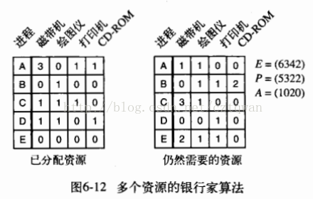
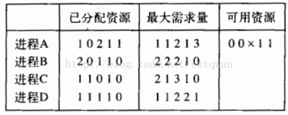

# Chapter 06 死锁 习题
- - - -
## 知识点小记
1. 从死锁中恢复：1.利用抢占恢复2.利用回滚恢复3.通过杀死进程恢复；
2. 安全状态：即使所有进程突然请求对资源的最大需求，也仍然存在某种调度次序能够使得每一个进程运行完毕。
不安全状态：任何分配资源实力的序列都无法保证工作的完成。
安全状态和不安全状态的区别是：从安全状态出发，系统能够保证所有进程都能完成；而从不安全状态出发，就没有这样的保证。
3. 死锁预防：
* **破坏互斥条件**：一 ~**切都使用假脱机技术**~ 。实现可能性较小，思路是避免分配那些不是绝对必须的资源；
* **破坏占有并等待条件**： **~在开始就请求全部资源~** 。一种实现方法是一次性分配请求所需的全部资源（资源利用率低）；另一种方法是，当一个进程请求资源时，先暂时是放弃当全占用的所有资源，然后再尝试一次获得所需的全部资源；
* **破环不可抢占条件**： **~抢占资源~**
* **破坏环路等待条件**： **~对资源按序编号~** 。将所有资源统一编号，进程可以在任何时刻提出资源请求，但是所有请求必须按照资源编号的顺序提出，按此规则资源分配途中肯定不会出现环；（变种）取消必须按升序请求资源的限制，而仅仅要求不许进程请求比当前所占有资源编号低的资源。
4. **通信死锁**是**协同同步**的异常情况；
**资源死锁**是**竞争性同步**的问题。
5. **活锁**指的是任务或者执行者没有被阻塞，由于某些条件没有满足，导致一直重复尝试—失败—尝试—失败的过程。处于活锁的实体是在不断的改变状态，活锁有可能自行解开。
- - - -
## 1.给出一个由策略产生的死锁的例子。
A：在美国，考虑总统选举，三个或更多的候选人正在争取某个政党的提名。初选结束后，当代表们到达党的选举大会时，可能没有候选人获得多数票，也没有任何代表愿意改变自己的投票。这是一个死锁。每个候选人都有一些资源（选票），但需要更多的选票才能胜出。在议会中有多个政党的国家，每个政党都支持不同版本的年度预算，但无法通过召集多数党来通过预算。这也是一个死锁。
- - - -
## 2.学生们在机房的个人计算机上将自己要打印的文件发送给服务器，服务器会将这些文件暂存在它的硬盘上。如果服务器磁盘空间有限，那么，在什么情况下会产生死锁？这样的死锁应该怎样避免？
A：磁盘缓冲区是有限的资源。每一个新到达的任务都需要请求更多的资源。如果具备10MB的缓冲空间，如何10个2MB的任务的一半到来，磁盘缓冲区将会填满，没有更多的空间可以存储，就会发生一个死锁。死锁可以通过让一个任务在缓冲区填满之前就开始打印，并且在打印完成后释放空间。这样一来，任务实际上会打印完成，然后下一个可以做同样的事情。如果在缓冲区被填满前，任务还不能开始打印，死锁是可能的。
- - - -
## 3.在前一题中，哪些资源是可抢占的，哪些资源是不可抢占的？
A：打印机不可抢占，磁盘空间可抢占。
- - - -
## 4.在图6-1中，资源释放的顺序与获得的顺序相反，以其他的顺序释放资源能否得到同样的结果？
A：可以，没有区别。
- - - -
## 5.一个资源死锁的发生有四个必要条件（互斥使用资源、占有和等待资源、不可抢占资源和环路等待资源）。举一个例子说明这些条件对于一个资源死锁的发生不是充分的。何时这些条件对一个资源死锁的发生是充分条件？
A：假设有三个进程A，B和C和两种资源类型R和S。并假设有一个R的实例和两个S的实例。考虑下面的场景：A请求R并得到它；B请求S并得到它；C请求S并得到它（有两个S实例）；B请求R但被阻塞；A请求S被阻塞。在这个阶段四条件都成立。但是，没有发生死锁。当C完成时，S的一个实例被释放到分配给A。现在A可以完成执行然后释放R，并分配给B，然后B可以完成其执行。如果有每种类型的资源只有一个实例，这4个条件就是充分的。
- - - -
## 6.城市街道很容易遇到循环阻塞的情况,我们称之为“僵局”。“僵局”是一个资源死锁和同步竞争的问题。纽约市的预防算法称为“非阻塞盒子”，除非一个交叉路口的后续空间是非阻塞的，否则禁止汽车进入这个交叉路口。这是哪种预防算法？你能否提供其他的预防算法来解决“僵局”问题？
A：属于“破坏占有并等待条件”，因为我们假设汽车可以在交叉路口后进入街道空间，从而释放交叉路口。另一种策略可能允许汽车暂时停在车库里，释放出足够的空间来解决交通堵塞。一些城市有交通管制政策来塑造交通；随着城市街道变得更加拥挤，交通监督员调整红灯的设置，以限制进入严重拥挤地区的交通。流量越小，资源竞争越少，从而降低了发生交通堵塞的可能性。
- - - -
## 7.假设四辆汽车同时从四个不同的方向是向同一个交叉路口，路口的每个拐角处都有一个停车标志。假设交通规则要求当两辆汽车同时接近相邻的停车标志时，左边的车必须让右边的车先行。那么当四辆车同时接近停车标志时，每辆车都会让右边的车先行。这是否是一个异常的通信死锁？这是否是一个资源死锁？
A：上述异常情况不是通信死锁，因为这些汽车彼此独立，如果没有竞争发生，它们会以最小的延迟通过交叉路口。这不是资源死锁，因为没有一辆汽车持有另一辆汽车请求的资源。资源预分配或资源抢占机制也无助于控制这种异常。然而，这种异常是竞争同步的一种，在这种情况下，汽车在循环链中等待资源，交通限制可能是一种有效的控制策略。为了区别于资源死锁，这种异常可能被称为“调度死锁”。类似的僵局可能会发生在一项法律规定，要求两列火车合并到一条共享铁路轨道上，等待另一列火车继续行驶。请注意，一名警察用信号通知其中一辆竞争的汽车或火车继续行驶(而不是其他汽车或火车)，可以打破这种停滞状态，而无需回滚或任何其他开销。
- - - -
## 8.有没有可能一个资源死锁涉及一个类型的多个单位和另一个类型的一个单位？如果有可能，请给出一个例子。
A：一个进程可能保存一种资源类型的一些或所有单元，并请求另一种资源类型，而另一个进程保存第二种资源，同时请求第一种资源类型的可用单元。如果没有其他进程可以释放第一种资源类型的单元，并且资源不能被抢占或同时使用，则系统处于死锁状态。例如，两个进程都是实际存储系统中分配的存储单元。(我们假设不支持页面或进程的交换，同时支持对内存的动态请求。)第一个进程锁定另一个资源——可能是数据单元。第二个进程请求锁定的数据并被阻止。第一个过程需要更多内存来执行代码以释放数据。假设系统中没有其他进程可以完成和释放内存单元，则系统中存在死锁。
- - - -
## 9.图6-3给出了资源分配图的概念，试问是否存在不合理的资源分配图，即资源分配图在结构上违反了使用资源的模型？如果存在，请给出一个例子。
A：是的，不合理的资源分配图存在。我们指出资源只能由一个进程获取。从方框代表的资源到圆代表的进程的弧表示进程拥有该资源。因此，一个方框如果指向两个或两个以上的圆意味着所有这些进程都持有该资源，这违反了规则。因此，在一个图中多个弧从一个方框指向不同的圆违反了规则，除非有多个资源的副本。从方框到方框或从圆到圆的弧线也违反规则。
- - - -
## 10.考虑图6-4.假设在图6-4o中，C请求S而不是请求R，这是都会导致死锁？假设它同时请求S和R，情况又如何？
A：都不会导致死锁。
- - - -
## 11.假设一个系统中存在一个资源死锁。举一个例子说明死锁的进程集合中可能包括了不在相应的资源分配图中循环链中的进程。
A：考虑三个过程A，B和C和两个资源R和S。假设A等待B持有的S，B等待A持有的S，和C是等待A持有的R。所有这三个进程，A，B和C发生死锁。然而，只有A和B属于循环链。
- - - -
## 12.为了控制流量，网络路由器A周期性地向邻居B发送消息，告诉它增加或者减少能够处理的包的数目。在某个时间点，路由器充斥着流量，因此A向B发送消息，通过指定B发送的数据量（A的窗口大小）为0来告诉它停止发送流量。流量高峰期过去之后，A向B发送一个新消息，通过将A的窗口大小从0增加到一个正数来告诉它重新启动数据传输。但是这条消息丢失了。如前所述，两方都不会传输数据。这是哪种类型的死锁？
A：通信死锁。可以通过超时并在一段时间后重新发送启用消息(增加窗口大小的消息)来控制(启发式)。然而，B可能已经收到了原始消息和重复消息。如果窗口大小的更新是以绝对值而不是差异给出的，那么不会有任何伤害。此类消息上的序列号对于检测重复也很有效。
- - - -
## 13.鸵鸟算法中提到了填充进程表表项或者其他系统表的可能。能否给出一种能够使系统管理员从这种状况下恢复系统的方法？
A：这些资源的一部分只能由管理员拥有的进程保留使用，所以管理员总是可以运行一个shell和程序来评估死锁并决定哪些进程要被杀死以便系统再次可用。
- - - -
## 14.使用6.4.2节中描述的死锁检测算法来说明该系统中存在一个死锁。并识别在死锁中的进程。
A：P1和P4会处于死锁。
- - - -
## 15.解释系统是如何从前面问题的死锁中恢复的，使用a)抢占，b)回滚，c)终止进程。
A：
	通过抢占恢复的过程：P2和P3完成后，进程P1可以强制抢占1个RS3 资源。这将使A =（0 2 1 3 2），并让进程P4完成。一旦P4完成并释放其资源P1可能完成。
	通过回滚恢复的过程：P1回滚到请求RS3之前的状态。
	通过杀死进程恢复的过程：杀死P1。
- - - -
## 16.假设在图6-6中，对某个i有Cij+Rij>Ej, 这意味着什么？
A：这个过程需要比系统更多的资源。它没有可能可以得到这些资源，所以它永远无法完成，即使没有其他进程需要任何资源。
- - - -
## 17.图6-8中的所有轨道都是水平的或者垂直的，你能否设想一种情况，使同样存在斜轨迹的可能。
A：如果系统有两个或多个CPU，两个或多个进程可以并行，也会导致斜轨迹。
- - - -
## 18.图6-8所示的资源轨迹模式是否可用来说明三个进程和三个资源的死锁问题？ 如果可以，它是怎样说明的？如果不可以，请解释为什么。
A：可以。在三个维度中考虑。z轴代测量第三进程请求的资源数。
- - - -
## 19.理论上，资源轨迹图可以用于避免死锁。通过合理的调度，操作系统可避免进人不安全区域。请列举一个在实际运用这种方法时会带来的问题。
A：该方法仅能在提前知道资源被请求的确切时刻时才能用于指导调度，但在实践中，这种情况很少。
- - - -
## 20.一个系统是否可能处于既非死锁也不安全的状态？如果可以，举出例子，如果不可以，请证明所有状态只能处于死锁或安全两种状态之一。
A：有些状态既不安全也不是死锁，但是会导致死锁。例如，假设有四个资源：磁带，绘图仪，扫描仪和CD-ROM，如下表所示，有三个进程存在竞争。可能存在以下情况：
	拥有	  需要	    可用
A： 2 0 0 0    1 0 2 0      01 2 1
B： 1 0 0 0     0 1 3 1
C： 0 1 2 1    1 0 1 0
	这种状态不是死锁，因为许多操作还可以发生，例如A仍然可以得到两台打印机。但是，如果每个进程请求其剩余的要求，就会产生死锁。
- - - -
## 21. 仔细考察图6-11b，如果D再多请求1个单位，会导致安全状态还是不安全状态？如果换成C提出同样请求，情形会怎样？
A：D再多请求1个单位，还是安全状态；若C提出同样的请求，变成不安全状态。
- - - -
## 22.某一系统有两个进程和三个相同的资源。每个进程最多需要两个资源。这种情况下有没有可能发生死锁？为什么？
A：该系统不可能发生死锁。假设每个进程都拥有一个资源。有一个资源是空闲的。任何一个进程可以要求它，并获得它，在这种情况下，它可以完成和释放这两种资源。因此，死锁是不会发生的。
- - - -
## 23.再考虑上一个问题，但现在有p个进程，每个进程最多需要m个资源，并且有r个资源可用。什么样的条件可以保证死锁不会发生？
A：如果进程有m个资源，它可以完成并且不会发生死锁。因此，最糟糕的情况是每个进程都有m-1个资源，需要另外一个资源。如果剩下一个资源，一个进程可以完成和释放所有资源，让其余的进程完成。因此，避免死锁的条件为r≥p(m-1)+ 1。
- - - -
## 24.假设图6-12中的进程 A请求最后一台磁带机，这一操作会引起起死锁吗？

A：不会，进程D还能完成，当它完成时，它返回足够的资源以允许进程E（或进程A）完成，等等。
- - - -
## 25. 银行家算法在一个有m个资源类型和n个进程的系统中运行。当m和n都很大时，为检査状态是否安全而进行的操作次数正比于m^a和n^b，a和b的值是多少？
A：将矩阵中的一行与可用资源的向量进行比较，可以进行m次操作，此步骤必须按顺序重复n次，以找到可以完成的进程并对其进行标记。因此，按照顺序标记一个进程需要进行mn步。对所有n个进程重复该算法意味着操作数为mn2。因此a = 1和b = 2。
- - - -
## 26.一个系统有4个进程和5个可分配资源，当前分配和最大需求如下：

## 若保持该状态是安全状态，x的最小值是多少？
A:需求矩阵如下：
		0 1 0 0 2
		0 2 1 0 0
		1 0 3 0 0
		0 0 1 1 1
	如果x为0，会立即死锁。如果x为1，则进程D可以运行完成。完成后，可用的资源为1 1 2 2 1，不幸的是，现在已经死锁了。如果x为2，进程D运行后，可用资源为1 1 3 2 1，进程C可以运行完成，并返回其资源，可用的资源为2 2 3 3 1，这将允许进程B运行和完成，然后进程A运行并完成。因此，避免死锁的x的最小值是2。
- - - -
## 27.一个消除环路等待的方法是用规则说明一个进程在任意时刻只能得到一个资源。举例说明在很多情况下这个限制是不可接受的。
A：考虑一个需要将大型文件从磁带复制到打印机的过程。因为内存量是有限的，整个文件不能直接复制到这个内存，所以该进程必须循环遍历以下语句直到整个文件被打印出来：
获取磁带机
将文件的下一部分复制到内存中（限制内存大小）
释放磁带机
获取打印机
从内存打印文件
释放打印机
这将延长进程的执行时间。此外，由于打印机在每次打印步骤之后被释放，所以不能保证文件的所有部分都将被打印在连续的页面上。
- - - -
## 28.两个进程A和B，每个进程都需要数据库中的3个记录1、 2、 3。如果A和B都以1、2、3的次序请求，将不会发生死锁。但是如果B以3、2、1的次序请求，那么死锁就有可能会发生。对于这3种资源，每个进程共有3!（即6）种次序请求，这些组合中有多大的可能可以保证不会发生死锁？
A:假设进程A以a，b，c的顺序请求记录。如果进程B首先请求a，其中一个进程将获得a，另一个将阻塞。这种情况总是不会死锁的，因为赢家现在可以完成而没有干扰。在其他四种组合中，有些可能导致死锁，有些可能不会导致死锁。六种情况如下：
			a b c无死锁
			a c b无死锁
			b a c可能死锁
			b c a可能死锁
			c a b可能死锁
			c b a可能死锁
	由于六种情况中的四种可能导致死锁，所以有1/3的机会避免死锁和2/3的机会导致死锁。
- - - -
## 29.一个使用信箱的分布式系统有两条 IPC原语：send和receive。receive原语用于指定从哪个进程接收消息，并且如果指定的进程没有可用消息，即使有从其他进程发来的消息，该进程也等待。不存在共享资源，但是进程由于其他原因需要经常通信。死锁会产生吗？请讨论这一问题。
A:会。假设所有的邮箱最初都是空的。现在A发送消息到B并等待回复，B发送到C并等待回复，C发送到A并等待回复。通信死锁的所有条件现在已经满足了。
- - - -
## 30.在一个电子资金转账系统中，有很多相同进程按如下方式工作：每一进程读取一行输人，该输入给出一定数目的款项、贷方账户、借方账户。然后该进程锁定两个账户，传送这笔钱，完成后释放锁。由于很多进程并行运行，所以存在这样的危险：锁定x会无法锁定y，因为y已被一个正在等待x的进程锁定。设计一个方案来避免死锁。在没有完成事务处理前不要释放该账户记录。（换句话说，在锁定一个账户时，如果发现另一个账户不能被锁定就立即释放这个已锁定的账户。）
A:为了避免循环等待，使用资源（帐户）的号码进行编号。读取输入行后，进程首先锁定较小编号的帐户，然后在成功锁定该账户后（可能需要等待）再去锁定另一个帐户。由于没有任何进程等待一个编号小于现有账户的账户，所以永远不会构成循环等待，因此永远不会发生死锁。
- - - -
## 31.一种预防死锁的方法是去除占有和等待条件。在本书中，假设在请求一个新的资源以前，进程必须释放所有它已经占有的资源（假设这是可能的）。然而，这样做会引入这样的危险性：使竞争的进程得到了新的资源但却丢失了原有的资源。请给出这一方法的改进。
A：更改请求新资源的语义如下。如果一个进程请求一个新的资源并且该资源是可用的，它就获取该资源并保持它已经拥有的资源。如果新资源不可用，则该进程所有已经占有的资源都将被释放。在这种情况下，死锁是不会发生的，并且没有新的资源获得后原有的资源丢失的危险性。当然这个进程只能工作在资源能够释放的情况下（你可以在页之间释放扫描仪，CD之间释放CD刻录机）。
- - - -
## 32.算机系学生想到了下面这个消除死锁的方法。当某一进程请求一个资源时，规定一个时间限。如果进程由干得不到需要的资源而阻塞，定时器开始运行。当超过时间限时，进程会被释放掉，并且允许该进程重新运行。如果你是教授，你会给这样的学生多少分？为什么？
A：我会给它一个F（失败）的成绩。进程会做什么？很显然由于它需要资源，所以它再次询问并再次阻塞，这不如保持阻塞。事实上，可能会更糟糕的是，系统可能会跟踪竞争进程等待了多长时间，并将新释放的资源分配给等待时间最长的进程。通过定期释放和重新运行，一个进程丢失了它已经等待的时间的记录。
- - - -
## 33.内存单元被叫唤去和虚拟内存系统抢占。处理器在分时环境中被抢占。你认为这些抢占方法是为了处理资源死锁还是有其他的目的？它们的开销有多大？
A：开发虚拟内存和分时系统主要是为了帮助系统用户。虚拟化硬件除了防止死锁之外，还保护用户免受预准备需求、资源分配和覆盖的细节影响。然而，上下文切换和中断处理的成本相当高。需要专门的寄存器、高速缓存和电路。仅仅为了防止死锁，可能不会产生这种成本。
- - - -
## 34. 解释死锁、活锁和饥饿的区别。
A：当一组进程被阻塞等待只有该集合中的其他进程可以释放的事件时，会发生死锁。另一方面，活锁中的进程不会被阻塞。相反，它们会继续检查永远不会成立的执行条件是否成立。因此，除了持有的资源之外，活动中的进程继续消耗宝贵的CPU时间。最后，会发生进程的饥饿，由于存在其他进程以及新的进程流，最终会导致饿死高优先级的进程。不像死锁或活锁，饥饿可以自己终止，例如当具有较高优先级的现有进程终止并且没有更高优先级的新进程到来时。（这里答案的翻译有问题，应该是“饥饿是由于存在其他进程以及新进入的进程流，这些进程的优先级比饥饿的进程高。”，并不是高优先级的进程被饿死。）
- - - -
## 35.假设两个进程发出查找命令来改变访问磁盘的机制，并启动读命令。每个进程在执行读命令之前被中断，并且发现另外一个进程已经移动了磁盘。它们都重新发出查找命令，但又同时被对方中断。这个序列不断的重复。这是一个资源死锁还是活锁？你推荐用什么方法来解决这个异常。
A：这种停滞状态是竞争同步的异常，可以通过资源预分配来控制。然而，进程不会被资源阻挡。此外，已经按线性顺序请求资源。这种异常不是资源死锁；这是一个活锁。资源预分配将防止这种异常。作为一种启发，如果进程没有在某个时间间隔内完成，它们可能会超时并释放资源，然后进入睡眠一段时间，然后再试一次。
- - - -
## 36.局域网使用一种叫做CSMA/CD的媒体访问方法。在这个方法中，站点之间共享一条总线，并且能够感知传输媒介以及检测传输和冲突。在以太网协议中，站点请求共享通道时如果感知到传输通道是忙碌的，那么它们不会传输帧。当传输结束的时候，等待的站点会继续传输帧。同时传输两个帧会产生冲突。如果站点在检测到冲突之后立即重复传输这些帧，则又会连续地产生冲突。
## (a)这是一个资源死锁还是活锁？
## (b)你能否为这种异常提出一个解决方法？
## (c)这种情况下会产生饥饿吗？
A：
(a)这是竞争同步异常。这也是一个活锁。我们可以称之为调度活锁。这不是资源活锁或死锁，因为站点不保存其他人请求的资源，因此不存在保存资源同时请求其他人的站点的循环链。这不是通信死锁，因为站是独立执行的，将按顺序完成传输。”
(b)在重传之前必须等待随机数量的时隙。每次连续碰撞后，选择时隙的时间间隔加倍，动态调整以适应繁重的交通负荷。在十六次连续重传之后，一帧被丢弃。
(c)有可能产生饥饿。因为接入信道是概率性的，并且因为新到达的站点可以在已经重发了几次的站点之前竞争并被分配信道。
- - - -
## 37.一个程序在合作和竞争机制的顺序上存在着错误，导致消费者进程在阻塞空缓冲区之前就锁定了互斥量（互斥信号量）。生产者进程能够将数据放在空缓冲区上已经唤醒消费者进程之前被阻塞在互斥量上。因此生产者进程和消费者进程都被一直阻塞，生产者进程等待互斥量被解锁，消费者进程等待生产者进程发出的信号。这是一个资源死锁还是通信死锁？请提出一种办法来解决进程之间的控制问题。
A：这种异常不是资源死锁。虽然进程共享互斥量，即竞争机制，但是资源预分配和死锁避免方法对于这种死态都是无效的。线性排序的资源也是无效的。事实上，人们可以争辩说，线性顺序可能是问题所在；执行互斥应该是进入前的最后一步，也应该是离开关键部分后的第一步。循环停滞状态确实存在，其中两个进程都等待只能由另一个进程引起的事件。这是通信死锁。为了取得进展，如果超时抢占消费者的互斥量，它将会打破这种僵局。编写谨慎的代码或使用监视器进行互斥是更好的解决方案。
- - - -
## 38.Cinderella和Prince要离婚，为分割财产，他们商定了以下算法。 每天早晨每个人发函给对方律师要求财产中的一项。由于邮递信件需要一天的时间，他们商定如果发现在同一天两人请求了同一项财产，第二天他们会发信取消这一要求。他们的财产包括狗Woofer、Woofer的狗屋、金丝雀Tweeter和Tweeter的鸟笼。由于这些动物喜爱它们的房屋，所以又商定任何将动物和它们房屋分开的方案都无效，且整个分配从头开始。Cinderella和Prince都非常想要Woofer，于是他们分别去度假，并且每人都编写程序用一台个人计算机处理这一谈判工作。当他们度假回来时，发现计算机仍在谈判，为什么？产生死锁了吗？产生饥饿了吗？请讨论。
A：如果两个程序首先要求Woofer，那么电脑会无休止的饥饿：请求Woofer，取消请求，请求Woofer，取消请求等。如果其中一个请求狗窝，另一个请求狗，会发生死锁，双方会检测到该死锁，然后取消，但会在下一个循环中重复发生。无论哪种方式，如果两台计算机都被编程为首先去请求狗或狗屋，那么饥饿或死锁就会发生。两者之间没有太大的区别。在大多数死锁问题中，饥饿似乎并不严重，因为引入随机延迟通常会使它不太可能发生，但这种方法在这里不起作用。
- - - -
## 39.一个主修人类学、辅修计算机科学的学生参加了一个研究课题，调查是否可以教会非洲狒拂理解死锁。他找到一处很深的峡谷，在上边固定了一根橫跨峡谷的绳索，这样狒拂就可以攀住绳索越过峡谷。同一时刻，只要朝着相同的方向就可以有几只狒狒通过。但如果向东和向西的狒拂同时攀在绳索上那么会产生死锁（拂拂会被卡在中间），因为它们无法在绳索上从另一只的背上翻过去。如果一只狒拂想越过峡谷，它必须看当前是否有别的狒拂正在逆向通行。利用信号量编写一个避免死锁的程序来解决该问题。不考虑连续东行的狒拂会使得西行的狒拂无限制地等待的情况。
A：
```c++
#define EAST 1;
#define WEST 2;
#define NULL 0;
typedef int semaphore;
int state = NULL;
semaphore mutex = 1;						//临界区的互斥
semaphore eastward;
semaphore westward;
int EastCount = 0;
int WestCount = 0;

void crossEastward()
{
	down(&mutex); 							//进入临界区
	if(state==NULL ||state==EAST)
	{
		state = EAST;
		up(&eastward);
	}
	EastCount++; 							//记录要通过的狒狒的数量
	up(&mutex);								//退出临界区

	down(&eastward);    					//开始过峡谷
	cross();

	down(&mutex);		 //离开峡谷的时候由于有更新所以也得确保互斥访问
 	EastCount--; 

	if(EastCount==0) 
	{ 
		STATE = NULL; 
		for(int i = 0; i < WestCount;i++) 
				up(&westward); 
		if(WestCount > 0)
				state = WEST; 
	} 
	up(&mutex); 
}

void crossWestward()
{
	down(&mutex); 							//进入临界区
	if(state==NULL ||state==West)
	{
		state = West;
		up(&westward);
	}
	WestCount++; 							//记录要通过的狒狒的数量
	up(&mutex);

	down(&westward);    					//开始过峡谷
	cross();

	down(&mutex);		 //离开峡谷的时候由于有更新所以也得确保互斥访问
 	WestCount--; 

	if(WestCount==0) 
	{ 
		STATE = NULL; 
		for(int i = 0; i < EastCount;i++) 
				up(&eastward); 
		if(EastCount > 0)
				state = East; 
	} 
	up(&mutex); 
}


```
- - - -
## 40.重复上一个习题，但此次要避免饥饿。当一只想向东去的狒狒来到绳索跟前，但发现有别的狒狒正在向西越过峡谷时，它会一直等到绳索可用为止。但在至少有一只狒拂向东越过峡谷之前，不允许再有拂狒开始从东向西越过峡谷。

- - - -
## 41.编写银行家算法的模拟程序。该程序应该能够循环检查每一个提出请求的银行客户，并且能判断这一请求是否安全。请把有关请求和相应决定的列表输出到一个文件中。

- - - -
## 42.写一个程序实现每种类型多个资源的死锁检测算法。你的程序应该从一个文件中读取下面的输入：进程数、资源类型数、每种存在类型的资源数（向量E）、 当前分配矩阵C （第一行，接着第二行，以此类推）、需求矩阵R（第一行，接着第二行，以此类推）。你的程序输出应表明在此系统屮是否有死锁。如果系统中有死锁，程序应该打印出所有死锁的进程id号。

- - - -
## 43.写一个程序使用资源分配图检测系统中是否存在死锁。你的程序应该从一个文件中读取下面的输入：进程数和资源数。对每个进程，你应该读取4个数：进程当前持有的资源数、它持有的资源的ID、它当前请求的资源数、它请求的资源ID。程序的输出应表明在此系统中是否有死锁。如果系统中有死锁，程序应该打印出所有死锁的进程id号。